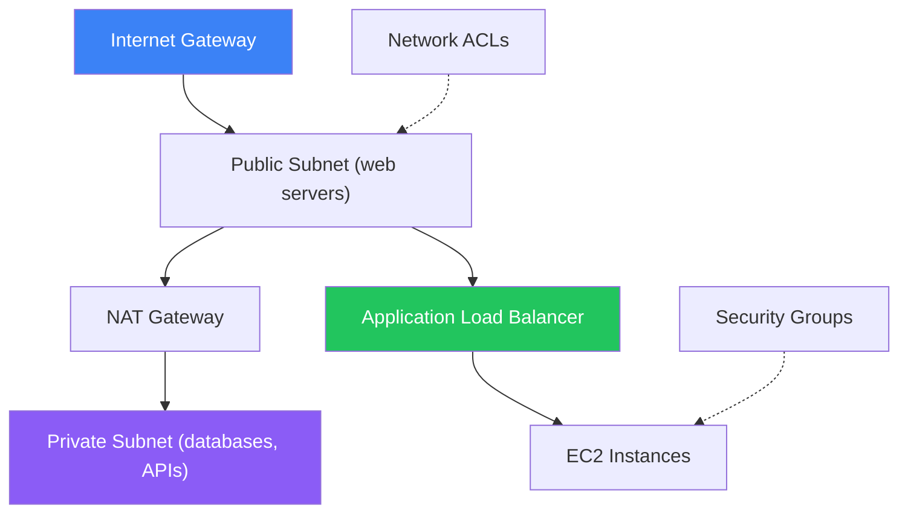

# VPC, CloudFront & Route53

Virtual networks, CDN, and DNS management

## VPC (Virtual Private Cloud)

VPC is your isolated network in AWS. You control IP ranges, subnets, route tables, and gateways. All AWS resources launch inside a VPC.

**VPC Architecture**

## CloudFront & Route53

- CloudFront — CDN with 400+ edge locations worldwide. Caches content close to users.
- Supports S3, ALB, EC2, and custom origins. HTTPS by default with ACM certificates.
- Route53 — managed DNS service. Routes users to the optimal endpoint.
- Routing policies: Simple, Weighted, Latency-based, Failover, Geolocation

