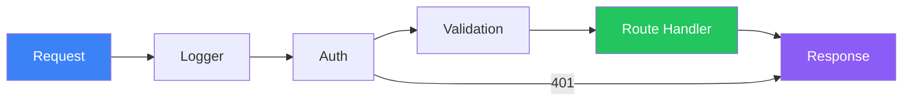

# Routing & Middleware

Request handling, middleware chain, and route patterns

## Routing

```typescript
// Express Routing & Middleware
import express, { Request, Response, NextFunction } from 'express';
const app = express();

// Built-in middleware
app.use(express.json());       // parse JSON body
app.use(express.urlencoded({ extended: true }));

// Custom logger middleware
app.use((req: Request, _res: Response, next: NextFunction) => {
  console.log(`${req.method} ${req.path} — ${new Date().toISOString()}`);
  next(); // MUST call next() or the request hangs
});

// Route parameters & query
app.get('/api/users/:id', (req, res) => {
  const { id } = req.params;        // /api/users/42 → id = "42"
  const { page } = req.query;       // ?page=2 → page = "2"
  res.json({ id, page });
});

// Route-specific middleware
function authenticate(req: Request, res: Response, next: NextFunction) {
  const token = req.headers.authorization?.replace('Bearer ', '');
  if (!token) return res.status(401).json({ error: 'Unauthorized' });
  try {
    req.user = verifyToken(token);
    next();
  } catch {
    res.status(403).json({ error: 'Invalid token' });
  }
}

app.get('/api/profile', authenticate, (req, res) => {
  res.json(req.user);
});

// Router for modular routes
const userRouter = express.Router();
userRouter.get('/', listUsers);
userRouter.post('/', createUser);
userRouter.get('/:id', getUser);
app.use('/api/users', userRouter);
```

## Middleware Flow

**Middleware Pipeline**



<QA question="What happens if you forget next() in middleware?">

The request hangs indefinitely — the next middleware/handler never runs and the client gets no response (eventually times out). Always call next() to pass control, or send a response to end the cycle.

</QA>