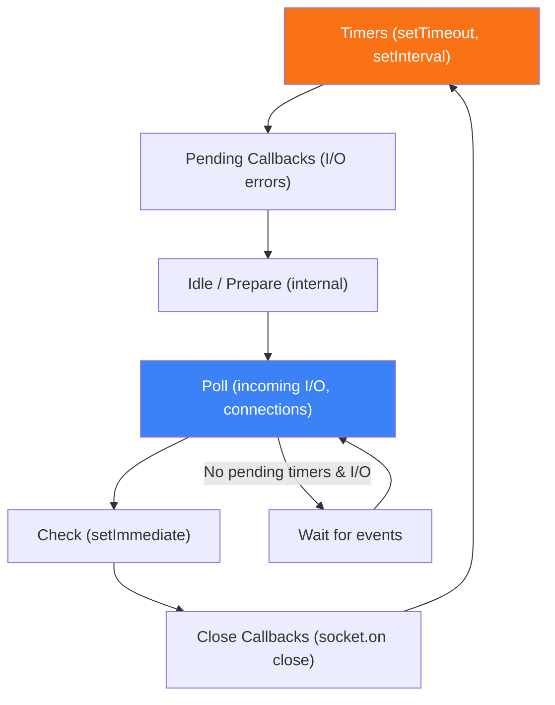

# Event Loop & Architecture

How Node.js handles concurrency with a single thread

## Node.js Event Loop

Node.js is single-threaded but non-blocking. It uses an event-driven architecture with libuv handling I/O operations in a thread pool, while the main thread processes callbacks via the event loop.

**Event Loop Phases**



```typescript
// Event Loop Phases Demo
console.log('1: sync start');

setTimeout(() => console.log('2: setTimeout'), 0);
setImmediate(() => console.log('3: setImmediate'));
process.nextTick(() => console.log('4: nextTick'));
Promise.resolve().then(() => console.log('5: Promise'));

console.log('6: sync end');

// Output: 1, 6, 4, 5, 2, 3
// nextTick > microtasks > macrotasks
```
