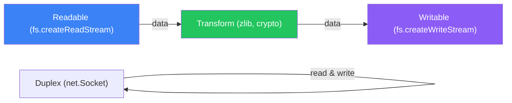

# Streams & Buffers

Processing data piece by piece without loading everything into memory

## Stream Types

**Stream Types**



```typescript
// Stream Examples
import { createReadStream, createWriteStream } from 'fs';
import { Transform } from 'stream';
import { pipeline } from 'stream/promises';
import { createGzip } from 'zlib';

// Pipe — read, compress, write
async function compressFile(input: string, output: string) {
  await pipeline(
    createReadStream(input),
    createGzip(),
    createWriteStream(output)
  );
}

// Custom transform stream
const upperCase = new Transform({
  transform(chunk, encoding, callback) {
    callback(null, chunk.toString().toUpperCase());
  }
});

// Process large file line by line
import { createInterface } from 'readline';
async function processCSV(path: string) {
  const rl = createInterface({
    input: createReadStream(path),
    crlfDelay: Infinity,
  });
  for await (const line of rl) {
    console.log(line); // process without loading entire file
  }
}
```

## Buffers

- Buffer — raw binary data (like a byte array). Used for file I/O, network, crypto.
- Buffer.from('hello') — create from string
- Buffer.alloc(1024) — allocate fixed size (zero-filled, safe)
- Buffer.allocUnsafe(1024) — faster but uninitialized (may contain old data)
- buf.toString('utf-8') — convert back to string

<QA question="When should you use streams vs reading the whole file?">

Use streams for large files (>100MB), real-time data, or when you need backpressure control. Use fs.readFile for small files where simplicity matters. Streams use O(1) memory regardless of file size.

</QA>