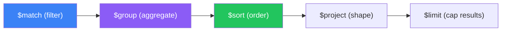

# Aggregation Pipeline

Complex data transformations and analytics

## Aggregation Pipeline

**Pipeline Flow**



```typescript
// Aggregation Examples
// Sales by category with average
const salesByCategory = await orders.aggregate([
  { $match: { status: 'completed', date: { $gte: new Date('2025-01-01') } } },
  { $unwind: '$items' },
  { $group: {
    _id: '$items.category',
    totalRevenue: { $sum: '$items.price' },
    avgPrice: { $avg: '$items.price' },
    count: { $sum: 1 },
  }},
  { $sort: { totalRevenue: -1 } },
  { $limit: 10 },
]).toArray();

// Lookup (JOIN equivalent)
const usersWithPosts = await users.aggregate([
  { $lookup: {
    from: 'posts',
    localField: '_id',
    foreignField: 'authorId',
    as: 'posts',
  }},
  { $addFields: { postCount: { $size: '$posts' } } },
  { $sort: { postCount: -1 } },
]).toArray();
```

