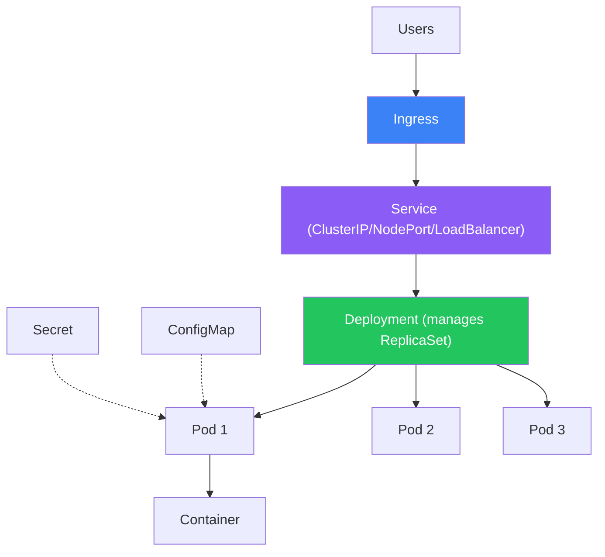

# Kubernetes Core

Pods, Deployments, Services, Ingress, ConfigMaps, Secrets, and Helm

## Core Objects

**Kubernetes Architecture**



```yaml
apiVersion: apps/v1
kind: Deployment
metadata:
  name: myapp
spec:
  replicas: 3
  selector:
    matchLabels: { app: myapp }
  template:
    metadata:
      labels: { app: myapp }
    spec:
      containers:
        - name: myapp
          image: myapp:1.0.0
          ports: [{ containerPort: 3000 }]
          resources:
            requests: { cpu: "100m", memory: "128Mi" }
            limits: { cpu: "500m", memory: "256Mi" }
          readinessProbe:
            httpGet: { path: /health, port: 3000 }
            initialDelaySeconds: 5
          env:
            - name: DB_URL
              valueFrom:
                secretKeyRef: { name: db-secret, key: url }
---
apiVersion: v1
kind: Service
metadata:
  name: myapp-svc
spec:
  selector: { app: myapp }
  ports: [{ port: 80, targetPort: 3000 }]
  type: ClusterIP
```

## Key Concepts

- Pod — smallest deployable unit. One or more containers sharing network/storage.
- Deployment — declarative updates for pods. Handles rolling updates and rollbacks.
- Service — stable network endpoint for pods. ClusterIP (internal), NodePort, LoadBalancer.
- Ingress — HTTP routing rules. Maps domains/paths to services.
- ConfigMap — non-sensitive configuration as key-value pairs.
- Secret — sensitive data (passwords, tokens). Base64 encoded.
- Helm — package manager. Charts = reusable K8s manifests with templating.

## kubectl Commands

```bash
kubectl get pods                    # list pods
kubectl get deployments             # list deployments
kubectl describe pod myapp-xxx      # detailed pod info
kubectl logs -f myapp-xxx           # follow pod logs
kubectl exec -it myapp-xxx -- sh    # shell into pod
kubectl apply -f manifest.yaml      # apply config
kubectl rollout restart deploy/myapp # restart deployment
kubectl scale deploy/myapp --replicas=5  # scale up
kubectl rollout undo deploy/myapp   # rollback
```
