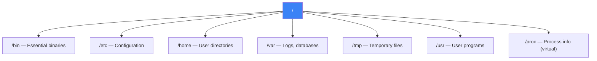

# Linux Essentials

File system hierarchy, essential commands, and permissions

## File System & Commands

**Linux File System**



```bash
# Navigation & files
ls -la              # list all with details
cd /var/log && pwd  # change dir, print working dir
mkdir -p dir/sub    # create nested dirs
cp -r src/ dest/    # recursive copy
mv old.txt new.txt  # rename/move
rm -rf dist/        # force remove (CAREFUL)
find . -name "*.log" -mtime +7 -delete  # find & delete old logs

# Text processing
cat file.txt | grep "ERROR" | wc -l     # count errors
grep -rn "TODO" ./src                     # recursive search with line numbers
awk '{print $1, $3}' data.txt            # print columns 1 and 3
sed 's/old/new/g' file.txt               # find & replace
tail -f /var/log/app.log                 # follow live logs

# Permissions
chmod 755 script.sh   # rwx r-x r-x
chmod u+x script.sh   # add execute for owner
chown -R www-data:www-data /var/www/

# Process management
ps aux | sort -k3 -rn | head -10  # top CPU processes
kill -9 <pid>                      # force kill
lsof -i :3000                     # what's using port 3000
htop                               # interactive process viewer

# Networking
curl -v https://api.com     # HTTP request with headers
ss -tlnp                    # listening ports
df -h                       # disk usage
free -h                     # memory usage
```
