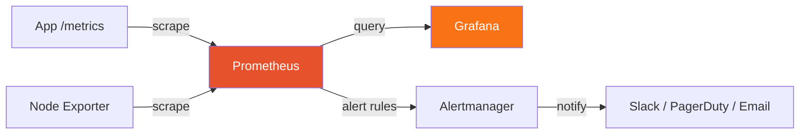

# Prometheus

Metrics collection, PromQL, exporters, and alerting

## Prometheus

Prometheus is a time-series database and monitoring system. It pulls metrics from targets at regular intervals, stores them, and supports powerful querying with PromQL.

**Prometheus Architecture**



## Metric Types & PromQL

- Counter — only increases (requests_total, errors_total)
- Gauge — can go up or down (temperature, active_connections)
- Histogram — distribution of values in buckets (request_duration_seconds)
- Summary — similar to histogram with quantiles

```promql
# Request rate (per second) over 5 minutes
rate(http_requests_total[5m])

# Error rate percentage
rate(http_requests_total{status=~"5.."}[5m])
/ rate(http_requests_total[5m]) * 100

# 95th percentile latency
histogram_quantile(0.95, rate(http_request_duration_seconds_bucket[5m]))

# CPU usage per pod
rate(container_cpu_usage_seconds_total{pod=~"myapp.*"}[5m])

# Memory usage in MB
container_memory_usage_bytes{pod=~"myapp.*"} / 1024 / 1024
```

## Exporters

- Node Exporter — system metrics (CPU, memory, disk, network)
- cAdvisor — container metrics (built into kubelet)
- Blackbox Exporter — probe endpoints (HTTP, DNS, TCP)
- App-level — instrument code with client libraries (prom-client for Node.js)

