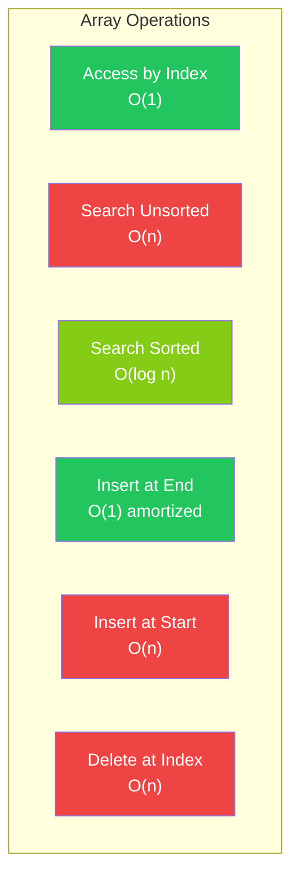

# Arrays & Strings

The most fundamental data structures in programming

## Arrays

Arrays are contiguous blocks of memory storing elements of the same type. They provide O(1) random access but O(n) insertion/deletion (unless at the end). In JavaScript, arrays are actually objects with numeric keys, making them more flexible but with different performance characteristics than C-style arrays.

**Array Operations Complexity**



```typescript
// Essential Array Techniques
// Reverse an array in-place
function reverse(arr: number[]): void {
  let left = 0, right = arr.length - 1;
  while (left < right) {
    [arr[left], arr[right]] = [arr[right], arr[left]];
    left++;
    right--;
  }
}

// Remove duplicates from sorted array (in-place)
function removeDuplicates(nums: number[]): number {
  if (nums.length === 0) return 0;
  let writeIdx = 1;
  for (let i = 1; i < nums.length; i++) {
    if (nums[i] !== nums[i - 1]) {
      nums[writeIdx] = nums[i];
      writeIdx++;
    }
  }
  return writeIdx;
}

// Kadane's Algorithm — Maximum subarray sum O(n)
function maxSubarraySum(nums: number[]): number {
  let maxSum = nums[0];
  let currentSum = nums[0];
  for (let i = 1; i < nums.length; i++) {
    currentSum = Math.max(nums[i], currentSum + nums[i]);
    maxSum = Math.max(maxSum, currentSum);
  }
  return maxSum;
}

// String: Check if anagram
function isAnagram(s: string, t: string): boolean {
  if (s.length !== t.length) return false;
  const count = new Map<string, number>();
  for (const c of s) count.set(c, (count.get(c) || 0) + 1);
  for (const c of t) {
    const val = count.get(c) || 0;
    if (val === 0) return false;
    count.set(c, val - 1);
  }
  return true;
}
```

<QA question="What's the difference between Array.slice() and Array.splice()?">

slice(start, end) returns a new array with elements from start to end (non-destructive). splice(start, deleteCount, ...items) modifies the original array by removing/replacing/adding elements (destructive). slice is O(k) where k is the slice size; splice is O(n) due to shifting.

</QA>

<QA question="How do JavaScript arrays differ from arrays in C/Java?">

JS arrays are dynamic (auto-resize), heterogeneous (can store mixed types), and are actually hash maps under the hood. They lack true O(1) guarantee for access in all engines, though V8 optimizes dense arrays to use contiguous memory.

</QA>