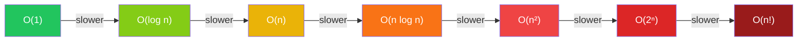

# Big O Notation

Understanding time and space complexity analysis

## What is Big O?

Big O notation describes the upper bound of an algorithm's growth rate. It tells us how the runtime or space requirements grow as the input size increases. This is the most critical concept in algorithm analysis and comes up in virtually every technical interview.

**Common Complexity Classes**



### Common Complexities

- O(1) — Constant: Array access, hash map lookup
- O(log n) — Logarithmic: Binary search, balanced BST operations
- O(n) — Linear: Single loop, linear search
- O(n log n) — Linearithmic: Merge sort, heap sort
- O(n²) — Quadratic: Nested loops, bubble sort
- O(2ⁿ) — Exponential: Recursive Fibonacci (naive), power set
- O(n!) — Factorial: Generating all permutations

### Analyzing Complexity

```typescript
// Examples of Different Complexities
// O(1) - Constant time
function getFirst(arr: number[]): number {
  return arr[0];
}

// O(log n) - Logarithmic
function binarySearch(arr: number[], target: number): number {
  let lo = 0, hi = arr.length - 1;
  while (lo <= hi) {
    const mid = Math.floor((lo + hi) / 2);
    if (arr[mid] === target) return mid;
    if (arr[mid] < target) lo = mid + 1;
    else hi = mid - 1;
  }
  return -1;
}

// O(n) - Linear
function sum(arr: number[]): number {
  let total = 0;
  for (const num of arr) total += num;
  return total;
}

// O(n²) - Quadratic
function bubbleSort(arr: number[]): number[] {
  const n = arr.length;
  for (let i = 0; i < n; i++) {
    for (let j = 0; j < n - i - 1; j++) {
      if (arr[j] > arr[j + 1]) {
        [arr[j], arr[j + 1]] = [arr[j + 1], arr[j]];
      }
    }
  }
  return arr;
}
```


<Callout variant="tip">

In interviews, always state both time AND space complexity. Many interviewers expect this without being asked.

</Callout>
