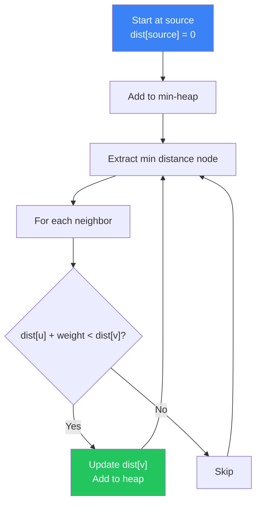

# Dijkstra's Algorithm

Shortest path in weighted graphs

## Dijkstra's Algorithm

Dijkstra's algorithm finds the shortest path from a source to all other vertices in a weighted graph with non-negative edges. It uses a priority queue (min-heap) and runs in O((V + E) log V) time.

**Dijkstra's Algorithm Flow**



```typescript
// Dijkstra's Implementation
function dijkstra(
  graph: Map<number, [number, number][]>, // node -> [neighbor, weight][]
  source: number,
  n: number
): number[] {
  const dist = new Array(n).fill(Infinity);
  dist[source] = 0;
  // Simple priority queue using sorted array (use heap for production)
  const pq: [number, number][] = [[0, source]]; // [dist, node]
  
  while (pq.length > 0) {
    pq.sort((a, b) => a[0] - b[0]);
    const [d, u] = pq.shift()!;
    if (d > dist[u]) continue; // stale entry
    
    for (const [v, w] of graph.get(u) || []) {
      if (dist[u] + w < dist[v]) {
        dist[v] = dist[u] + w;
        pq.push([dist[v], v]);
      }
    }
  }
  return dist;
}
```