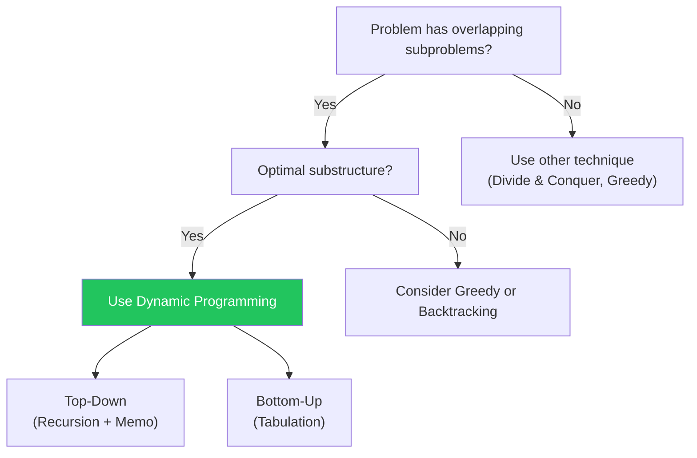

# Dynamic Programming

Solve complex problems by breaking them into overlapping subproblems

## Dynamic Programming

DP solves problems by breaking them into overlapping subproblems and storing results to avoid recomputation. The key steps: 1) Define subproblems, 2) Write recurrence relation, 3) Determine computation order, 4) Extract answer. DP can be top-down (memoization) or bottom-up (tabulation).

**DP Approach Decision Tree**



```typescript
// Classic DP Problems
// Fibonacci — Bottom-up O(n) time, O(1) space
function fibonacci(n: number): number {
  if (n <= 1) return n;
  let prev = 0, curr = 1;
  for (let i = 2; i <= n; i++) {
    [prev, curr] = [curr, prev + curr];
  }
  return curr;
}

// Coin Change — O(amount × coins.length)
function coinChange(coins: number[], amount: number): number {
  const dp = new Array(amount + 1).fill(Infinity);
  dp[0] = 0;
  for (let i = 1; i <= amount; i++) {
    for (const coin of coins) {
      if (coin <= i) dp[i] = Math.min(dp[i], dp[i - coin] + 1);
    }
  }
  return dp[amount] === Infinity ? -1 : dp[amount];
}

// Longest Common Subsequence — O(m × n)
function lcs(text1: string, text2: string): number {
  const m = text1.length, n = text2.length;
  const dp = Array.from({ length: m + 1 }, () => new Array(n + 1).fill(0));
  for (let i = 1; i <= m; i++) {
    for (let j = 1; j <= n; j++) {
      dp[i][j] = text1[i - 1] === text2[j - 1]
        ? dp[i - 1][j - 1] + 1
        : Math.max(dp[i - 1][j], dp[i][j - 1]);
    }
  }
  return dp[m][n];
}

// 0/1 Knapsack — O(n × W)
function knapsack(weights: number[], values: number[], W: number): number {
  const n = weights.length;
  const dp = Array.from({ length: n + 1 }, () => new Array(W + 1).fill(0));
  for (let i = 1; i <= n; i++) {
    for (let w = 0; w <= W; w++) {
      dp[i][w] = dp[i - 1][w]; // don't take
      if (weights[i - 1] <= w) {
        dp[i][w] = Math.max(dp[i][w], dp[i - 1][w - weights[i - 1]] + values[i - 1]);
      }
    }
  }
  return dp[n][W];
}

// Longest Increasing Subsequence — O(n log n) with binary search
function lengthOfLIS(nums: number[]): number {
  const tails: number[] = [];
  for (const n of nums) {
    let lo = 0, hi = tails.length;
    while (lo < hi) {
      const mid = lo + Math.floor((hi - lo) / 2);
      if (tails[mid] < n) lo = mid + 1;
      else hi = mid;
    }
    tails[lo] = n;
  }
  return tails.length;
}
```

