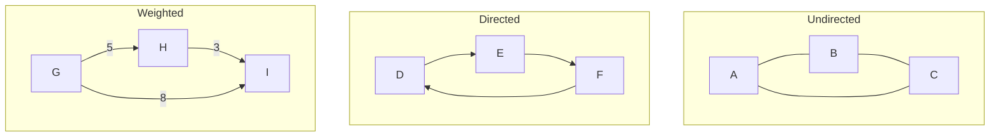

# Graphs

Networks of nodes and edges

## Graph Representations & Traversals

Graphs model relationships between entities. They can be directed/undirected, weighted/unweighted, cyclic/acyclic. Graphs appear in social networks, maps, dependency resolution, and countless interview problems.

**Graph Types**



```typescript
// Graph Implementation & BFS/DFS
// Adjacency List representation
class Graph {
  private adj = new Map<string, string[]>();

  addEdge(u: string, v: string, directed = false): void {
    if (!this.adj.has(u)) this.adj.set(u, []);
    this.adj.get(u)!.push(v);
    if (!directed) {
      if (!this.adj.has(v)) this.adj.set(v, []);
      this.adj.get(v)!.push(u);
    }
  }

  // BFS — O(V + E) — Level-order, shortest path in unweighted
  bfs(start: string): string[] {
    const visited = new Set<string>([start]);
    const queue = [start];
    const result: string[] = [];
    while (queue.length) {
      const node = queue.shift()!;
      result.push(node);
      for (const neighbor of this.adj.get(node) || []) {
        if (!visited.has(neighbor)) {
          visited.add(neighbor);
          queue.push(neighbor);
        }
      }
    }
    return result;
  }

  // DFS — O(V + E) — Path finding, cycle detection
  dfs(start: string): string[] {
    const visited = new Set<string>();
    const result: string[] = [];
    const visit = (node: string) => {
      visited.add(node);
      result.push(node);
      for (const neighbor of this.adj.get(node) || []) {
        if (!visited.has(neighbor)) visit(neighbor);
      }
    };
    visit(start);
    return result;
  }
}

// Number of Islands — Classic BFS/DFS
function numIslands(grid: string[][]): number {
  const rows = grid.length, cols = grid[0].length;
  let count = 0;
  
  function dfs(r: number, c: number): void {
    if (r < 0 || r >= rows || c < 0 || c >= cols || grid[r][c] === '0') return;
    grid[r][c] = '0'; // mark visited
    dfs(r + 1, c); dfs(r - 1, c); dfs(r, c + 1); dfs(r, c - 1);
  }
  
  for (let r = 0; r < rows; r++) {
    for (let c = 0; c < cols; c++) {
      if (grid[r][c] === '1') { count++; dfs(r, c); }
    }
  }
  return count;
}
```

<QA question="When do you use BFS vs DFS?">

Use BFS for shortest path in unweighted graphs, level-order traversal, and when the solution is close to the root. Use DFS for topological sorting, cycle detection, path finding, and when you need to explore all possibilities (backtracking). BFS uses more memory (queue) while DFS uses the call stack.

</QA>