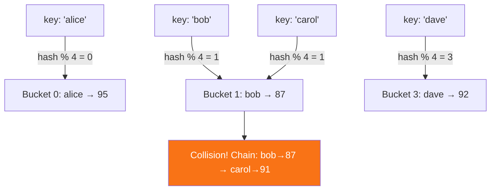

# HashMap & Set

O(1) average lookup with hashing

## Hash Maps & Sets

Hash maps (objects/Maps in JS) provide average O(1) lookup, insert, and delete by mapping keys to indices via a hash function. Sets store unique values with similar O(1) operations. These are the most commonly used data structures in interview solutions.

**Hash Map Internal Structure**



```typescript
// HashMap & Set Patterns
// Frequency Counter Pattern
function topKFrequent(nums: number[], k: number): number[] {
  const freq = new Map<number, number>();
  for (const n of nums) freq.set(n, (freq.get(n) || 0) + 1);
  
  return [...freq.entries()]
    .sort((a, b) => b[1] - a[1])
    .slice(0, k)
    .map(([key]) => key);
}

// Group Anagrams using HashMap
function groupAnagrams(strs: string[]): string[][] {
  const map = new Map<string, string[]>();
  for (const s of strs) {
    const key = s.split('').sort().join('');
    if (!map.has(key)) map.set(key, []);
    map.get(key)!.push(s);
  }
  return [...map.values()];
}

// Set: Find intersection of two arrays
function intersection(a: number[], b: number[]): number[] {
  const setA = new Set(a);
  return [...new Set(b.filter(x => setA.has(x)))];
}

// Longest Consecutive Sequence — O(n) with Set
function longestConsecutive(nums: number[]): number {
  const set = new Set(nums);
  let maxLen = 0;
  for (const n of set) {
    if (!set.has(n - 1)) { // start of a sequence
      let len = 1;
      while (set.has(n + len)) len++;
      maxLen = Math.max(maxLen, len);
    }
  }
  return maxLen;
}
```

