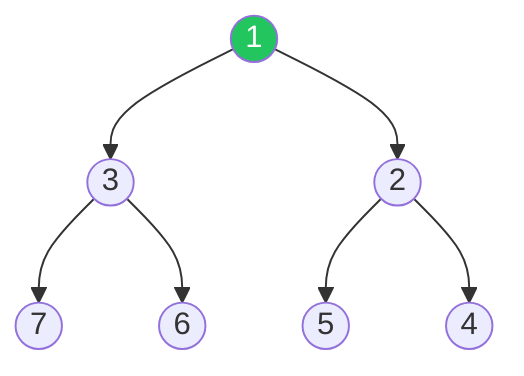

# Heaps & Priority Queues

Efficient min/max element access

## Heaps

A heap is a complete binary tree where each parent node satisfies the heap property (min-heap: parent ≤ children; max-heap: parent ≥ children). Heaps power priority queues and are essential for problems involving the kth largest/smallest element.

**Min Heap Structure**



```typescript
// Min Heap Implementation
class MinHeap {
  private heap: number[] = [];

  private parent(i: number) { return Math.floor((i - 1) / 2); }
  private left(i: number) { return 2 * i + 1; }
  private right(i: number) { return 2 * i + 2; }

  push(val: number): void {
    this.heap.push(val);
    this.bubbleUp(this.heap.length - 1);
  }

  pop(): number | undefined {
    if (this.heap.length === 0) return undefined;
    const min = this.heap[0];
    const last = this.heap.pop()!;
    if (this.heap.length > 0) {
      this.heap[0] = last;
      this.sinkDown(0);
    }
    return min;
  }

  peek(): number | undefined { return this.heap[0]; }
  get size(): number { return this.heap.length; }

  private bubbleUp(i: number): void {
    while (i > 0 && this.heap[i] < this.heap[this.parent(i)]) {
      [this.heap[i], this.heap[this.parent(i)]] = 
        [this.heap[this.parent(i)], this.heap[i]];
      i = this.parent(i);
    }
  }

  private sinkDown(i: number): void {
    let smallest = i;
    const l = this.left(i), r = this.right(i);
    if (l < this.heap.length && this.heap[l] < this.heap[smallest]) smallest = l;
    if (r < this.heap.length && this.heap[r] < this.heap[smallest]) smallest = r;
    if (smallest !== i) {
      [this.heap[i], this.heap[smallest]] = [this.heap[smallest], this.heap[i]];
      this.sinkDown(smallest);
    }
  }
}

// Kth Largest Element — O(n log k)
function findKthLargest(nums: number[], k: number): number {
  const heap = new MinHeap();
  for (const n of nums) {
    heap.push(n);
    if (heap.size > k) heap.pop();
  }
  return heap.peek()!;
}
```

