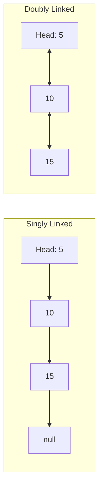

# Linked Lists

Dynamic data structures with pointer-based traversal

## Linked Lists

A linked list is a linear data structure where elements are stored in nodes, each pointing to the next. Unlike arrays, linked lists don't require contiguous memory and allow O(1) insertion/deletion at known positions, but lack random access.

**Singly vs Doubly Linked List**



```typescript
// Linked List Implementation
class ListNode<T> {
  val: T;
  next: ListNode<T> | null = null;
  constructor(val: T) { this.val = val; }
}

class LinkedList<T> {
  head: ListNode<T> | null = null;

  // O(1) - Insert at head
  prepend(val: T): void {
    const node = new ListNode(val);
    node.next = this.head;
    this.head = node;
  }

  // O(n) - Insert at tail
  append(val: T): void {
    const node = new ListNode(val);
    if (!this.head) { this.head = node; return; }
    let curr = this.head;
    while (curr.next) curr = curr.next;
    curr.next = node;
  }

  // O(n) - Delete by value
  delete(val: T): boolean {
    if (!this.head) return false;
    if (this.head.val === val) { this.head = this.head.next; return true; }
    let curr = this.head;
    while (curr.next) {
      if (curr.next.val === val) {
        curr.next = curr.next.next;
        return true;
      }
      curr = curr.next;
    }
    return false;
  }

  // O(n) - Reverse the list
  reverse(): void {
    let prev: ListNode<T> | null = null;
    let curr = this.head;
    while (curr) {
      const next = curr.next;
      curr.next = prev;
      prev = curr;
      curr = next;
    }
    this.head = prev;
  }
}

// Detect cycle — Floyd's Algorithm
function hasCycle<T>(head: ListNode<T> | null): boolean {
  let slow = head, fast = head;
  while (fast?.next) {
    slow = slow!.next;
    fast = fast.next.next;
    if (slow === fast) return true;
  }
  return false;
}

// Find middle node
function findMiddle<T>(head: ListNode<T> | null): ListNode<T> | null {
  let slow = head, fast = head;
  while (fast?.next) {
    slow = slow!.next;
    fast = fast.next.next;
  }
  return slow;
}
```

