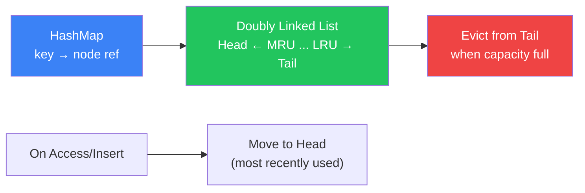

# LRU Cache

Least Recently Used cache with O(1) operations

## LRU Cache

An LRU Cache evicts the least recently used item when full. It combines a hash map (O(1) lookup) with a doubly linked list (O(1) removal and insertion) to achieve O(1) for both get and put. This is one of the most popular interview questions.

**LRU Cache Structure**



```typescript
// LRU Cache Implementation
class DLLNode {
  key: number; val: number;
  prev: DLLNode | null = null;
  next: DLLNode | null = null;
  constructor(key: number, val: number) { this.key = key; this.val = val; }
}

class LRUCache {
  private capacity: number;
  private map = new Map<number, DLLNode>();
  private head = new DLLNode(0, 0); // dummy
  private tail = new DLLNode(0, 0); // dummy

  constructor(capacity: number) {
    this.capacity = capacity;
    this.head.next = this.tail;
    this.tail.prev = this.head;
  }

  get(key: number): number {
    const node = this.map.get(key);
    if (!node) return -1;
    this.moveToHead(node);
    return node.val;
  }

  put(key: number, value: number): void {
    if (this.map.has(key)) {
      const node = this.map.get(key)!;
      node.val = value;
      this.moveToHead(node);
    } else {
      const node = new DLLNode(key, value);
      this.map.set(key, node);
      this.addToHead(node);
      if (this.map.size > this.capacity) {
        const lru = this.tail.prev!;
        this.remove(lru);
        this.map.delete(lru.key);
      }
    }
  }

  private addToHead(node: DLLNode): void {
    node.prev = this.head;
    node.next = this.head.next;
    this.head.next!.prev = node;
    this.head.next = node;
  }

  private remove(node: DLLNode): void {
    node.prev!.next = node.next;
    node.next!.prev = node.prev;
  }

  private moveToHead(node: DLLNode): void {
    this.remove(node);
    this.addToHead(node);
  }
}
```

<QA question="Can you implement LRU Cache using JavaScript's built-in Map?">

Yes! JavaScript's Map maintains insertion order. You can delete and re-insert a key to move it to the end (most recent). To evict, use map.keys().next().value to get the oldest key. This gives you O(1) operations without implementing a doubly linked list.

</QA>