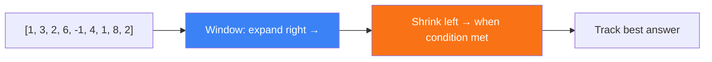

# Sliding Window

Optimize subarray/substring problems

## Sliding Window Technique

The sliding window technique converts brute-force O(n²) subarray/substring problems to O(n). It uses two pointers (left, right) to maintain a 'window' of elements, expanding right and shrinking left based on conditions.

**Sliding Window Pattern**



```typescript
// Sliding Window Problems
// Maximum sum subarray of size k
function maxSumSubarray(arr: number[], k: number): number {
  let sum = 0, maxSum = -Infinity;
  for (let i = 0; i < arr.length; i++) {
    sum += arr[i];
    if (i >= k) sum -= arr[i - k];
    if (i >= k - 1) maxSum = Math.max(maxSum, sum);
  }
  return maxSum;
}

// Longest substring without repeating characters
function lengthOfLongestSubstring(s: string): number {
  const seen = new Map<string, number>();
  let maxLen = 0, left = 0;
  for (let right = 0; right < s.length; right++) {
    if (seen.has(s[right]) && seen.get(s[right])! >= left) {
      left = seen.get(s[right])! + 1;
    }
    seen.set(s[right], right);
    maxLen = Math.max(maxLen, right - left + 1);
  }
  return maxLen;
}

// Minimum window substring
function minWindow(s: string, t: string): string {
  const need = new Map<string, number>();
  for (const c of t) need.set(c, (need.get(c) || 0) + 1);
  
  let have = 0, required = need.size;
  let left = 0, minLen = Infinity, result = '';
  const window = new Map<string, number>();
  
  for (let right = 0; right < s.length; right++) {
    const c = s[right];
    window.set(c, (window.get(c) || 0) + 1);
    if (need.has(c) && window.get(c) === need.get(c)) have++;
    
    while (have === required) {
      if (right - left + 1 < minLen) {
        minLen = right - left + 1;
        result = s.slice(left, right + 1);
      }
      const d = s[left++];
      window.set(d, window.get(d)! - 1);
      if (need.has(d) && window.get(d)! < need.get(d)!) have--;
    }
  }
  return result;
}
```