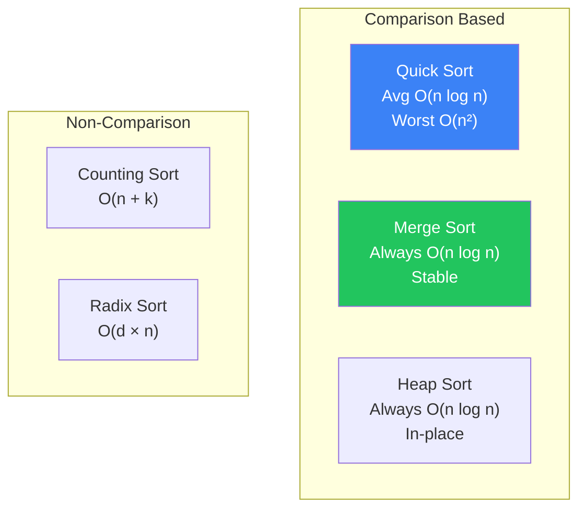

# Sorting Algorithms

Comparison and non-comparison sorting techniques

## Sorting Algorithms

Sorting is fundamental to computer science. Understanding when to use which algorithm is key. Quick sort is generally fastest in practice, merge sort guarantees O(n log n) and is stable, and counting/radix sort beat O(n log n) for special cases.

**Sorting Algorithm Comparison**



```typescript
// Merge Sort & Quick Sort
// Merge Sort — O(n log n) time, O(n) space, stable
function mergeSort(arr: number[]): number[] {
  if (arr.length <= 1) return arr;
  const mid = Math.floor(arr.length / 2);
  const left = mergeSort(arr.slice(0, mid));
  const right = mergeSort(arr.slice(mid));
  return merge(left, right);
}

function merge(a: number[], b: number[]): number[] {
  const result: number[] = [];
  let i = 0, j = 0;
  while (i < a.length && j < b.length) {
    if (a[i] <= b[j]) result.push(a[i++]);
    else result.push(b[j++]);
  }
  return [...result, ...a.slice(i), ...b.slice(j)];
}

// Quick Sort — O(n log n) average, O(n²) worst, in-place
function quickSort(arr: number[], lo = 0, hi = arr.length - 1): void {
  if (lo >= hi) return;
  const pivot = partition(arr, lo, hi);
  quickSort(arr, lo, pivot - 1);
  quickSort(arr, pivot + 1, hi);
}

function partition(arr: number[], lo: number, hi: number): number {
  const pivot = arr[hi];
  let i = lo;
  for (let j = lo; j < hi; j++) {
    if (arr[j] < pivot) {
      [arr[i], arr[j]] = [arr[j], arr[i]];
      i++;
    }
  }
  [arr[i], arr[hi]] = [arr[hi], arr[i]];
  return i;
}
```