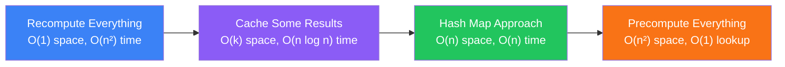

# Space vs Time Tradeoffs

Understanding when to trade memory for speed and vice versa

## The Fundamental Tradeoff

One of the most important concepts in algorithm design is the space-time tradeoff. You can often make an algorithm faster by using more memory, or use less memory at the cost of speed. Knowing when and how to make this tradeoff is a key interview skill.

**Space-Time Tradeoff Spectrum**



### Classic Example: Two Sum

```typescript
// Brute Force vs Hash Map
// Approach 1: O(n²) time, O(1) space
function twoSumBrute(nums: number[], target: number): [number, number] {
  for (let i = 0; i < nums.length; i++) {
    for (let j = i + 1; j < nums.length; j++) {
      if (nums[i] + nums[j] === target) return [i, j];
    }
  }
  return [-1, -1];
}

// Approach 2: O(n) time, O(n) space — trade space for time
function twoSumHash(nums: number[], target: number): [number, number] {
  const map = new Map<number, number>();
  for (let i = 0; i < nums.length; i++) {
    const complement = target - nums[i];
    if (map.has(complement)) return [map.get(complement)!, i];
    map.set(nums[i], i);
  }
  return [-1, -1];
}
```

<Callout variant="info">

In most interviews, the hash map approach (trading space for time) is preferred. Interviewers usually want to see O(n) time solutions when possible.

</Callout>

