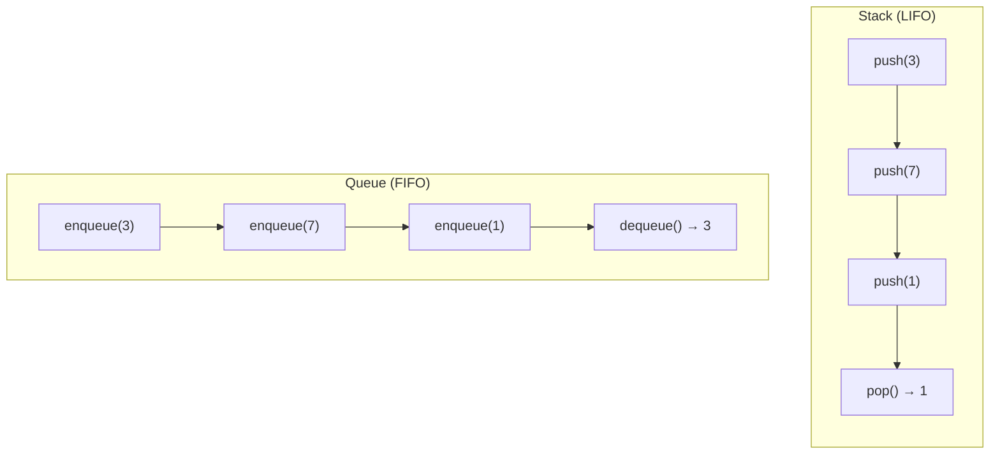

# Stack & Queue

LIFO and FIFO data structures

## Stack (LIFO) & Queue (FIFO)

Stacks follow Last-In-First-Out order (think of a stack of plates). Queues follow First-In-First-Out order (think of a line at a store). Both are fundamental and appear in countless interview problems.

**Stack vs Queue**



```typescript
// Stack & Queue + Classic Problems
// Stack using array
class Stack<T> {
  private items: T[] = [];
  push(item: T): void { this.items.push(item); }
  pop(): T | undefined { return this.items.pop(); }
  peek(): T | undefined { return this.items[this.items.length - 1]; }
  isEmpty(): boolean { return this.items.length === 0; }
  get size(): number { return this.items.length; }
}

// Queue using array (for interviews; use linked list for production)
class Queue<T> {
  private items: T[] = [];
  enqueue(item: T): void { this.items.push(item); }
  dequeue(): T | undefined { return this.items.shift(); }
  peek(): T | undefined { return this.items[0]; }
  isEmpty(): boolean { return this.items.length === 0; }
  get size(): number { return this.items.length; }
}

// Classic: Valid Parentheses
function isValidParentheses(s: string): boolean {
  const stack: string[] = [];
  const map: Record<string, string> = { ')': '(', ']': '[', '}': '{' };
  for (const c of s) {
    if ('([{'.includes(c)) {
      stack.push(c);
    } else {
      if (stack.pop() !== map[c]) return false;
    }
  }
  return stack.length === 0;
}

// Min Stack — O(1) getMin
class MinStack {
  private stack: number[] = [];
  private mins: number[] = [];

  push(val: number): void {
    this.stack.push(val);
    this.mins.push(
      this.mins.length === 0 
        ? val 
        : Math.min(val, this.mins[this.mins.length - 1])
    );
  }
  pop(): void { this.stack.pop(); this.mins.pop(); }
  top(): number { return this.stack[this.stack.length - 1]; }
  getMin(): number { return this.mins[this.mins.length - 1]; }
}
```

<QA question="How is a call stack related to the Stack data structure?">

The call stack is literally a stack. Each function call pushes a frame onto the stack; when a function returns, its frame is popped. This is why recursive calls can cause Stack Overflow — too many frames pushed without popping. Understanding this helps debug recursion issues.

</QA>