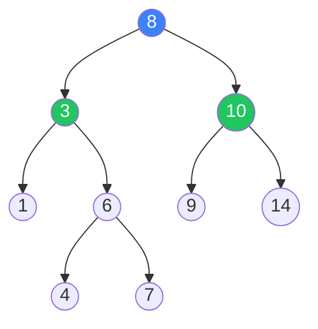

# Trees (BST, AVL, Red-Black)

Hierarchical data structures for efficient searching and sorting

## Binary Trees & BSTs

Trees are hierarchical data structures. A Binary Search Tree (BST) maintains the property that left children are smaller and right children are larger than the parent. Balanced BSTs (AVL, Red-Black) guarantee O(log n) operations by preventing degeneration into a linked list.

**Binary Search Tree Structure**



```typescript
// BST Implementation & Traversals
class TreeNode<T> {
  val: T;
  left: TreeNode<T> | null = null;
  right: TreeNode<T> | null = null;
  constructor(val: T) { this.val = val; }
}

// Inorder Traversal (sorted order for BST)
function inorder<T>(root: TreeNode<T> | null): T[] {
  if (!root) return [];
  return [...inorder(root.left), root.val, ...inorder(root.right)];
}

// BST Search — O(log n) average
function search<T>(root: TreeNode<T> | null, target: T): boolean {
  if (!root) return false;
  if (root.val === target) return true;
  return target < root.val 
    ? search(root.left, target) 
    : search(root.right, target);
}

// BST Insert — O(log n) average
function insert(root: TreeNode<number> | null, val: number): TreeNode<number> {
  if (!root) return new TreeNode(val);
  if (val < root.val) root.left = insert(root.left, val);
  else if (val > root.val) root.right = insert(root.right, val);
  return root;
}

// Max depth of binary tree
function maxDepth<T>(root: TreeNode<T> | null): number {
  if (!root) return 0;
  return 1 + Math.max(maxDepth(root.left), maxDepth(root.right));
}

// Lowest Common Ancestor in BST
function lcaBST(
  root: TreeNode<number> | null,
  p: number,
  q: number
): TreeNode<number> | null {
  if (!root) return null;
  if (p < root.val && q < root.val) return lcaBST(root.left, p, q);
  if (p > root.val && q > root.val) return lcaBST(root.right, p, q);
  return root; // split point = LCA
}

// Validate BST
function isValidBST(
  root: TreeNode<number> | null,
  min = -Infinity,
  max = Infinity
): boolean {
  if (!root) return true;
  if (root.val <= min || root.val >= max) return false;
  return isValidBST(root.left, min, root.val) 
      && isValidBST(root.right, root.val, max);
}
```

<QA question="Why do we need balanced BSTs like AVL and Red-Black trees?">

An unbalanced BST can degenerate into a linked list (e.g., inserting sorted data), making operations O(n). AVL trees maintain strict balance (height diff ≤ 1), giving guaranteed O(log n). Red-Black trees are slightly less strict but faster for insertions. Java's TreeMap uses Red-Black; many databases use B-trees (a generalization).

</QA>