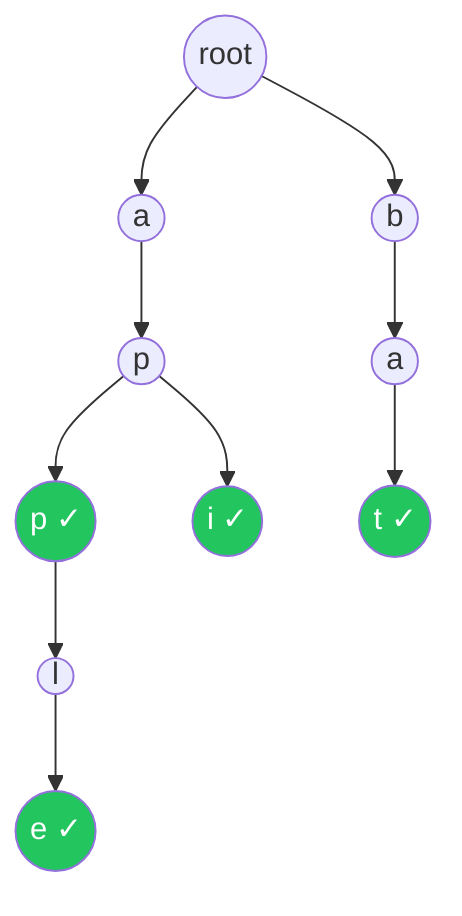

# Trie (Prefix Tree)

Efficient string prefix storage and retrieval

## Trie

A Trie is a tree-like data structure used for efficient storage and retrieval of strings. Each node represents a character, and paths from root to marked nodes represent stored words. Tries excel at prefix operations like autocomplete and spell checking.

**Trie storing: 'app', 'apple', 'api', 'bat'**



```typescript
// Trie Implementation
class TrieNode {
  children = new Map<string, TrieNode>();
  isEnd = false;
}

class Trie {
  private root = new TrieNode();

  insert(word: string): void {
    let node = this.root;
    for (const ch of word) {
      if (!node.children.has(ch)) node.children.set(ch, new TrieNode());
      node = node.children.get(ch)!;
    }
    node.isEnd = true;
  }

  search(word: string): boolean {
    const node = this.findNode(word);
    return node !== null && node.isEnd;
  }

  startsWith(prefix: string): boolean {
    return this.findNode(prefix) !== null;
  }

  private findNode(s: string): TrieNode | null {
    let node = this.root;
    for (const ch of s) {
      if (!node.children.has(ch)) return null;
      node = node.children.get(ch)!;
    }
    return node;
  }

  // Autocomplete: find all words with prefix
  autocomplete(prefix: string): string[] {
    const node = this.findNode(prefix);
    if (!node) return [];
    const results: string[] = [];
    const dfs = (n: TrieNode, path: string) => {
      if (n.isEnd) results.push(path);
      for (const [ch, child] of n.children) dfs(child, path + ch);
    };
    dfs(node, prefix);
    return results;
  }
}
```

