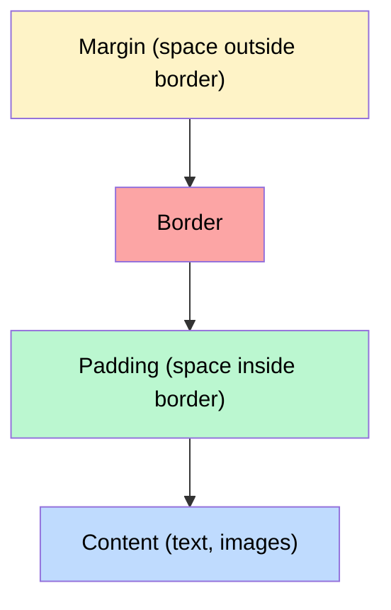

# Box Model

Content, padding, border, and margin — how elements occupy space

## The Box Model

Every HTML element is a box with four layers: content (innermost), padding, border, and margin (outermost). By default, width/height apply only to content. Use box-sizing: border-box to include padding and border.

**CSS Box Model**



```css
// Box Model in Practice
/* Always use border-box */
*, *::before, *::after {
  box-sizing: border-box;
}

.card {
  width: 300px;        /* total width = 300px (with border-box) */
  padding: 20px;       /* inside space */
  border: 1px solid #ddd;
  margin: 16px auto;   /* outside space, auto = center horizontally */
}

/* Margin collapse: vertical margins of adjacent elements merge */
/* Top 20px + bottom 20px = 20px gap (not 40px) */
.paragraph { margin: 20px 0; }

/* Preventing margin collapse */
.parent {
  overflow: hidden;    /* creates new BFC */
  /* or: display: flow-root; */
}
```

<QA question="What is margin collapse and when does it happen?">

Adjacent vertical margins merge into one (the larger wins). It happens between: sibling elements, parent-child (if no border/padding), and empty elements. It does NOT happen with flexbox, grid, floats, or absolute positioning.

</QA>