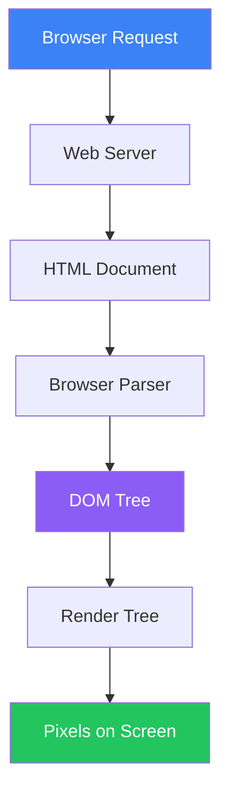

# HTML Core Concepts

HyperText Markup Language fundamentals and document structure

## What is HTML?

HyperText Markup Language (HTML) is the standard markup language for structuring web content. It defines the meaning and structure of content using elements represented by tags.

```html
// Basic HTML Document
<!DOCTYPE html>
<html lang="en">
  <head>
    <meta charset="UTF-8" />
    <meta name="viewport" content="width=device-width, initial-scale=1.0" />
    <title>My Page</title>
  </head>
  <body>
    <h1>Hello World</h1>
    <p>Welcome to my website.</p>
  </body>
</html>
```

## How HTML Works

**HTML Request → Render Flow**


