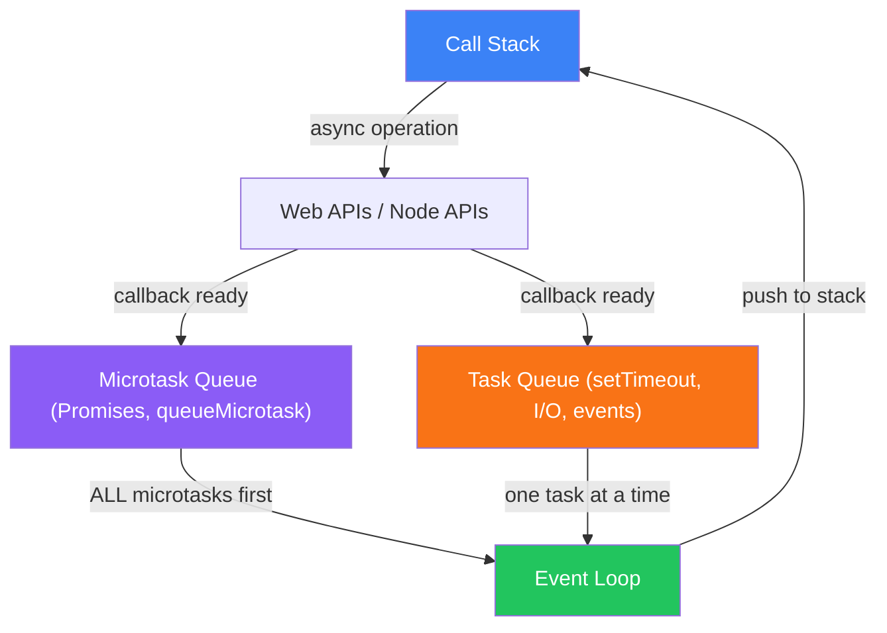

# Event Loop

How JavaScript handles async operations under the hood

## The Event Loop

JavaScript is single-threaded but non-blocking thanks to the event loop. It continuously checks: is the call stack empty? If so, take the next task from the queue.

**Event Loop Architecture**



```js
// Event Loop Priority
console.log("1: sync");

setTimeout(() => console.log("2: setTimeout"), 0);

Promise.resolve().then(() => console.log("3: microtask"));

queueMicrotask(() => console.log("4: queueMicrotask"));

console.log("5: sync");

// Output: 1, 5, 3, 4, 2
// Microtasks (Promises) always run BEFORE macrotasks (setTimeout)
// Even setTimeout(fn, 0) waits for all microtasks to drain
```

