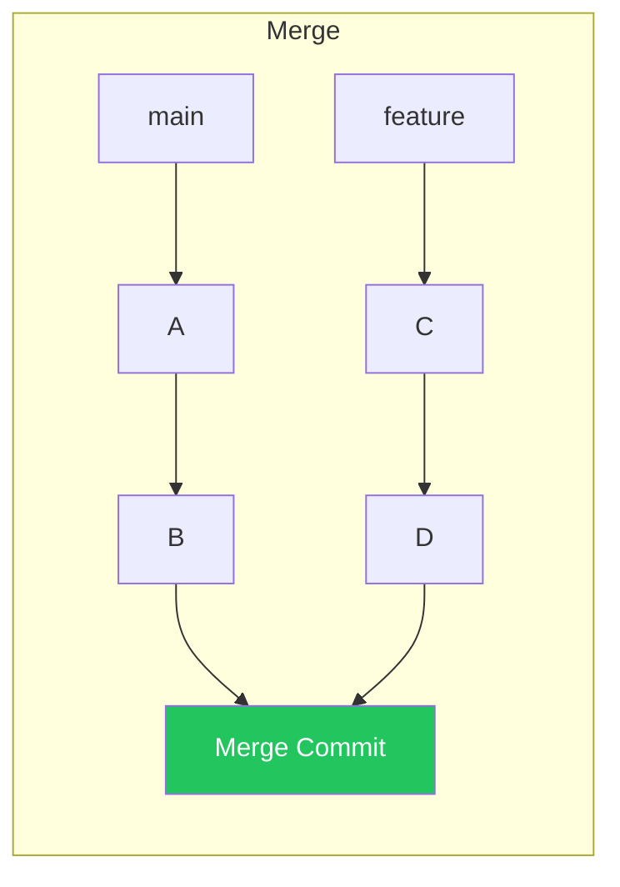

# Branching, Merge & Rebase

Branch operations, merge strategies, and rebase workflows

## Branch Operations

```bash
# Create & switch
git branch feature/login           # create branch
git checkout -b feature/login      # create + switch (classic)
git switch -c feature/login        # create + switch (modern)

# Merge
git checkout main
git merge feature/login            # merge (creates merge commit if diverged)
git merge --squash feature/login   # squash all commits into one

# Rebase — replay commits on top of another branch
git checkout feature/login
git rebase main                    # replay feature commits onto main
# Then: git checkout main && git merge feature/login (fast-forward)

# Interactive rebase — rewrite history
git rebase -i HEAD~5               # edit last 5 commits
# pick  = keep, squash = merge into previous, reword = change message
# edit  = pause for changes, drop = remove commit
```

## Merge vs Rebase

**Merge vs Rebase**



