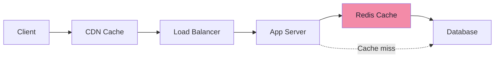

# Caching Strategies

Cache patterns, eviction policies, and CDNs

## Caching Strategies

Caching stores copies of frequently accessed data in a faster storage layer to reduce latency and database load. Proper caching can improve performance by 10-100x.

**Cache Architecture**



### Caching Patterns

```typescript
// Cache-Aside (Lazy Loading)
// Most common pattern — app manages cache
async function getUser(userId: string): Promise<User> {
  // 1. Check cache first
  const cached = await redis.get(`user:${userId}`);
  if (cached) return JSON.parse(cached); // Cache HIT

  // 2. Cache miss — read from database
  const user = await db.users.findById(userId);

  // 3. Populate cache for next time
  await redis.setex(`user:${userId}`, 3600, JSON.stringify(user));

  return user;
}

// Write-through: Write to cache AND database together
async function updateUser(userId: string, data: Partial<User>) {
  const user = await db.users.update(userId, data);
  await redis.setex(`user:${userId}`, 3600, JSON.stringify(user));
  return user;
}

// Write-behind: Write to cache, async write to database
async function updateUserAsync(userId: string, data: Partial<User>) {
  await redis.setex(`user:${userId}`, 3600, JSON.stringify(data));
  queue.publish('user-update', { userId, data }); // async DB update
}
```

### Cache Eviction Policies

- LRU (Least Recently Used): Evicts the item that hasn't been accessed for the longest time. Most commonly used.
- LFU (Least Frequently Used): Evicts the item accessed the fewest times. Good for skewed access patterns.
- TTL (Time To Live): Items expire after a fixed duration. Simple and predictable.
- FIFO (First In First Out): Evicts oldest items first. Simplest but often least effective.
- Random Replacement: Randomly selects item to evict. Surprisingly effective in some cases.

