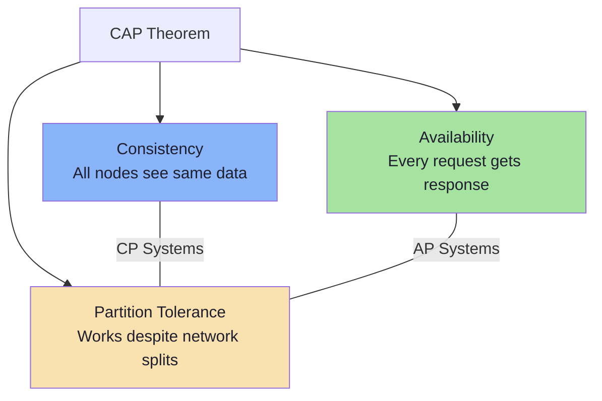

# CAP Theorem

Consistency, Availability, and Partition Tolerance trade-offs

## CAP Theorem

CAP theorem states that in a distributed system, you can only guarantee two of three properties simultaneously: Consistency, Availability, and Partition Tolerance. Since network partitions are inevitable, the real choice is between consistency and availability.

**CAP Triangle**

### System Categories

- CP (Consistency + Partition Tolerance): MongoDB, HBase, Redis Cluster — favors correctness over availability. On partition, some nodes refuse requests.
- AP (Availability + Partition Tolerance): Cassandra, DynamoDB, CouchDB — favors availability over consistency. On partition, nodes serve potentially stale data.
- CA (Consistency + Availability): Traditional RDBMS (single node) — not truly distributed, so partition tolerance isn't needed.

<Callout variant="info">

In practice, most systems use tunable consistency. For example, Cassandra lets you set consistency level per query (ONE, QUORUM, ALL), trading between consistency and availability on a per-request basis.

</Callout>