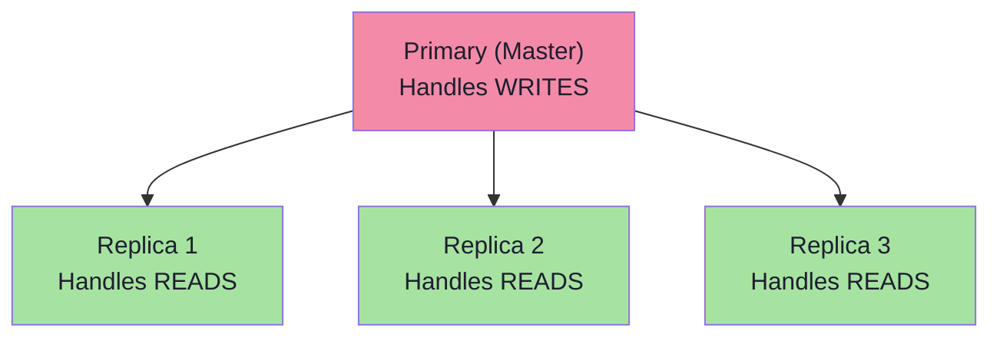

# Database Design at Scale

Sharding, replication, SQL vs NoSQL, and data partitioning

## Database Design at Scale

At scale, a single database becomes a bottleneck. Understanding replication (copies of data), sharding (splitting data), and choosing between SQL and NoSQL is essential for system design interviews.

### Replication

**Master-Slave Replication**



### Sharding Strategies

```text
1. Range-Based Sharding
   ├── Shard 1: Users A-H
   ├── Shard 2: Users I-P
   └── Shard 3: Users Q-Z
   ✅ Simple, range queries possible
   ❌ Uneven distribution (hotspots)

2. Hash-Based Sharding
   ├── shard = hash(user_id) % num_shards
   ├── Evenly distributes data
   └── Uses consistent hashing for rebalancing
   ✅ Even distribution
   ❌ No range queries, resharding is expensive

3. Geographic Sharding
   ├── Shard US: Users in Americas
   ├── Shard EU: Users in Europe
   └── Shard APAC: Users in Asia-Pacific
   ✅ Low latency for regional users
   ❌ Cross-region queries are expensive

4. Directory-Based Sharding
   ├── Lookup service maps key → shard
   ├── Most flexible approach
   └── Lookup service is single point of failure
   ✅ Flexible mapping
   ❌ Lookup overhead, single point of failure
```

### SQL vs NoSQL Decision Framework

- Choose SQL when: you need ACID transactions, complex joins, structured data with relationships, data integrity is critical (banking, e-commerce)
- Choose NoSQL when: you need flexible schema, horizontal scalability, high write throughput, hierarchical data (MongoDB), key-value access patterns (Redis), wide-column (Cassandra), graph relationships (Neo4j)
- Common pattern: Use SQL for transactional data + NoSQL for caches, sessions, analytics, and search