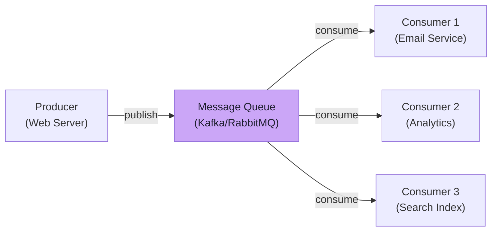

# Message Queues

Async processing with Kafka, RabbitMQ, and SQS

## Message Queues

Message queues enable asynchronous communication between services. Producers send messages to a queue, and consumers process them independently. This decouples services, improves reliability, and enables load leveling.

**Message Queue Architecture**



### When to Use Message Queues

- Async Processing: Email sending, image processing, report generation
- Load Leveling: Buffer traffic spikes, process at constant rate
- Decoupling: Services communicate without knowing each other
- Fan-out: Same message processed by multiple consumers
- Retry Logic: Failed messages re-queued automatically
- Event Sourcing: Store events as immutable sequence

### Comparison

```text
┌────────────────┬──────────────────┬──────────────────┬──────────────────┐
│ Feature        │ Kafka            │ RabbitMQ         │ SQS              │
├────────────────┼──────────────────┼──────────────────┼──────────────────┤
│ Model          │ Log/Stream       │ Queue/Exchange   │ Queue            │
│ Throughput     │ Millions/sec     │ Thousands/sec    │ Thousands/sec    │
│ Ordering       │ Per-partition    │ Per-queue        │ Best-effort      │
│ Retention      │ Configurable     │ Until consumed   │ 14 days max      │
│ Use Case       │ Event streaming  │ Task queues      │ Serverless async │
│ Replay         │ Yes              │ No               │ No               │
│ Protocol       │ TCP binary       │ AMQP             │ HTTP/HTTPS       │
└────────────────┴──────────────────┴──────────────────┴──────────────────┘
```