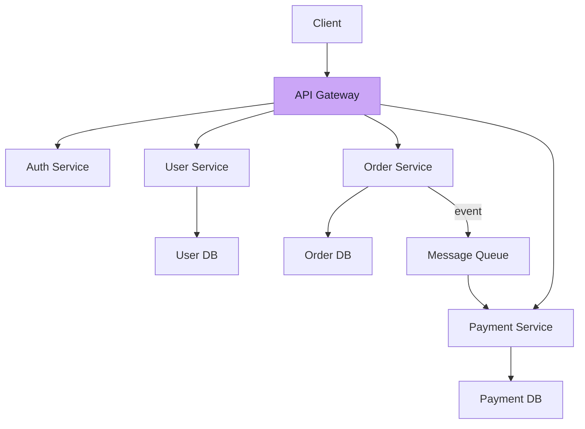

# Microservices Architecture

Service decomposition, API gateways, and communication patterns

## Microservices Architecture

Microservices decompose an application into small, independently deployable services, each running its own process and communicating via lightweight protocols (HTTP/gRPC/events).

**Microservices Architecture**



### Communication Patterns

- Synchronous (REST/gRPC): Direct request-response. Simple but creates coupling. Use for queries that need immediate response.
- Asynchronous (Events/Messages): Publish-subscribe via message queue. Decoupled but eventual consistency. Use for commands that can be processed later.
- API Gateway: Single entry point for all services. Handles routing, auth, rate limiting, SSL termination.
- Service Mesh: Infrastructure layer (Istio, Linkerd) handling service-to-service communication, observability, and security.
- Saga Pattern: Manage distributed transactions across services using a sequence of local transactions with compensating actions.

### Monolith vs Microservices

```text
┌─────────────────────┬─────────────────────┬──────────────────────┐
│ Aspect              │ Monolith            │ Microservices        │
├─────────────────────┼─────────────────────┼──────────────────────┤
│ Deployment          │ Single unit         │ Independent services │
│ Scaling             │ Scale entire app    │ Scale per service    │
│ Development         │ Simple initially    │ Complex from start   │
│ Team Size           │ Small teams         │ Large organizations  │
│ Data Consistency    │ ACID transactions   │ Eventual consistency │
│ Latency             │ In-process calls    │ Network calls        │
│ Debugging           │ Single process      │ Distributed tracing  │
│ Technology          │ Single stack        │ Polyglot             │
│ When to Use         │ MVP, small teams    │ Scale, large teams   │
└─────────────────────┴─────────────────────┴──────────────────────┘
```