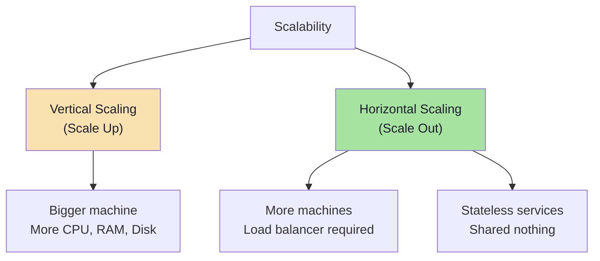

# Scalability

Horizontal vs vertical scaling, load balancing, and capacity planning

## Scalability

Scalability is the ability of a system to handle growing amounts of load by adding resources. There are two main approaches: vertical scaling (scale up) and horizontal scaling (scale out).

**Scaling Strategies**



### Vertical Scaling (Scale Up)

- Add more power to existing machine (CPU, RAM, SSD)
- Simpler — no code changes needed
- Limited by hardware ceiling
- Single point of failure
- Example: Upgrading database server from 16GB to 128GB RAM

### Horizontal Scaling (Scale Out)

- Add more machines to the pool
- Requires load balancer to distribute traffic
- No theoretical ceiling
- Requires stateless application design
- More complex — need to handle data consistency
- Example: Going from 1 web server to 10 behind a load balancer

### Load Balancing Strategies

```text
Round Robin
  → Requests distributed sequentially to each server
  → Simple but doesn't account for server load

Weighted Round Robin
  → Servers with higher capacity get more requests
  → Better for heterogeneous server clusters

Least Connections
  → New request goes to server with fewest active connections
  → Best for long-lived connections (WebSockets)

IP Hash
  → Client IP determines which server handles request
  → Ensures session stickiness

Consistent Hashing
  → Minimizes redistribution when servers are added/removed
  → Used by CDNs and distributed caches
```

```text
upstream backend {
    # Round Robin (default)
    server backend1.example.com;
    server backend2.example.com;
    server backend3.example.com;

    # Weighted
    server backend1.example.com weight=5;
    server backend2.example.com weight=3;

    # Least connections
    least_conn;

    # Health check
    server backend1.example.com max_fails=3 fail_timeout=30s;
}

server {
    listen 80;
    location / {
        proxy_pass http://backend;
    }
}
```

<QA question="When should you scale vertically vs horizontally?">

Scale vertically when: you need quick improvements, application is stateful, or database needs more RAM/CPU. Scale horizontally when: you need high availability (no single point of failure), expect continued growth beyond hardware limits, or can design stateless services. Most real systems use both — scale up the database, scale out the application tier.

</QA>