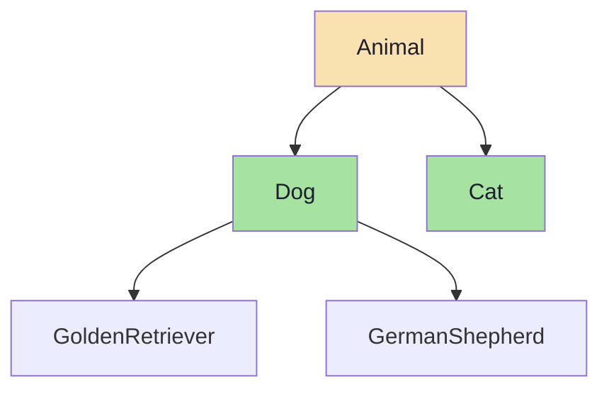

# Inheritance

Code reuse through class hierarchies

## Inheritance

Inheritance allows a class (child/subclass) to inherit properties and methods from another class (parent/superclass). It promotes code reuse and establishes an 'is-a' relationship between classes.

**Inheritance Hierarchy**



```java
// Inheritance in Java
// Base class
public class Animal {
    protected String name;
    protected int age;

    public Animal(String name, int age) {
        this.name = name;
        this.age = age;
    }

    public void eat() {
        System.out.println(name + " is eating");
    }

    public void sleep() {
        System.out.println(name + " is sleeping");
    }
}

// Derived class
public class Dog extends Animal {
    private String breed;

    public Dog(String name, int age, String breed) {
        super(name, age); // Call parent constructor
        this.breed = breed;
    }

    // New method specific to Dog
    public void bark() {
        System.out.println(name + " says Woof!");
    }

    // Override parent method
    @Override
    public void eat() {
        System.out.println(name + " is eating dog food");
    }
}

// Usage
Dog dog = new Dog("Buddy", 3, "Golden Retriever");
dog.eat();   // "Buddy is eating dog food" (overridden)
dog.sleep(); // "Buddy is sleeping" (inherited)
dog.bark();  // "Buddy says Woof!" (new method)
```

```python
// Inheritance in Python
class Animal:
    def __init__(self, name: str, age: int):
        self.name = name
        self.age = age

    def eat(self) -> None:
        print(f"{self.name} is eating")

    def sleep(self) -> None:
        print(f"{self.name} is sleeping")

class Dog(Animal):
    def __init__(self, name: str, age: int, breed: str):
        super().__init__(name, age)  # Call parent constructor
        self.breed = breed

    def bark(self) -> None:
        print(f"{self.name} says Woof!")

    def eat(self) -> None:  # Override
        print(f"{self.name} is eating dog food")

# Multiple Inheritance (Python-specific)
class ServiceDog(Dog):
    def __init__(self, name, age, breed, service_type):
        super().__init__(name, age, breed)
        self.service_type = service_type

    def assist(self):
        print(f"{self.name} is assisting with {self.service_type}")
```

- Single Inheritance: One parent class → one child class
- Multi-level Inheritance: Chain of inheritance (A → B → C)
- Multiple Inheritance: Child inherits from multiple parents (Python supports, Java uses interfaces)
- Hierarchical Inheritance: Multiple children from one parent
- Method Overriding: Child redefines a parent method
- super keyword: Calls the parent class constructor or method

<Callout variant="warning">

Favor composition over inheritance. Deep inheritance hierarchies (more than 2-3 levels) become hard to understand and maintain. Use inheritance for 'is-a' relationships and composition for 'has-a' relationships.

</Callout>