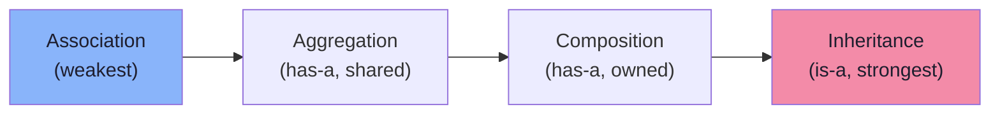

# Association, Aggregation & Composition

Object relationships and their strength

## Object Relationships

Objects relate to each other in different ways. Understanding these relationships is crucial for designing clean systems.

**Relationship Strength**



```java
// Relationship Examples
// ASSOCIATION — loose relationship, both exist independently
class Student {
    private String name;
    void attendCourse(Course course) { /* uses Course */ }
}
class Course {
    private String title;
}

// AGGREGATION — "has-a" but parts can exist independently
class Department {
    private String name;
    private List<Professor> professors; // professors exist without dept

    void addProfessor(Professor prof) {
        professors.add(prof);
    }
}

// COMPOSITION — "has-a" but parts cannot exist without parent
class House {
    private List<Room> rooms; // rooms don't exist without house

    public House(int numRooms) {
        rooms = new ArrayList<>();
        for (int i = 0; i < numRooms; i++) {
            rooms.add(new Room()); // House creates and owns rooms
        }
    }

    // When House is destroyed, Rooms are destroyed too
}
```

- Association: Uses-a relationship. Both objects exist independently. Teacher uses a Classroom.
- Aggregation: Has-a relationship (weak ownership). Parts can exist without the whole. University has Professors.
- Composition: Has-a relationship (strong ownership). Parts cannot exist without the whole. Car has an Engine.
- Dependency: Uses-a temporarily. Method receives object as parameter.