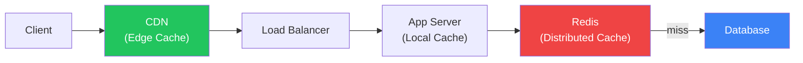

# Caching Strategies

Multi-layer caching for performance

## Caching in System Design

**Multi-Layer Cache**

### Caching Patterns

- Cache-Aside (Lazy Loading): App checks cache → miss → queries DB → writes to cache
- Write-Through: App writes to cache AND DB simultaneously — consistent but slower writes
- Write-Behind (Write-Back): App writes to cache → async write to DB — fast but risk of loss
- Read-Through: Cache handles DB fetching transparently
- Refresh-Ahead: Proactively refresh before TTL expires

### Cache Invalidation

"There are only two hard things in CS: cache invalidation and naming things." Strategies: TTL (time-to-live), event-based invalidation (publish changes), and versioned keys.

