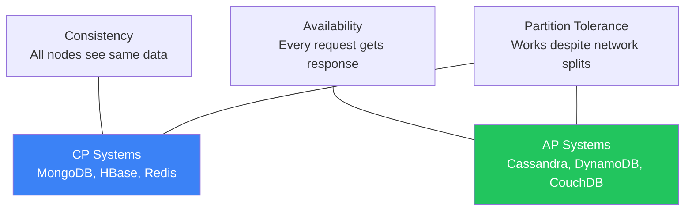

# CAP Theorem

Understanding tradeoffs in distributed systems

## CAP Theorem

CAP theorem states that a distributed system can only guarantee two of three properties: Consistency (all nodes see the same data), Availability (every request gets a response), and Partition Tolerance (system works despite network failures). Since network partitions are inevitable, you're really choosing between CP and AP.

**CAP Theorem**

### Consistency Models

- Strong Consistency: Read always returns the latest write (like a single-node DB)
- Eventual Consistency: Reads may return stale data temporarily, but converge
- Causal Consistency: If A causes B, everyone sees A before B
- Read-Your-Writes: A user always sees their own writes immediately

