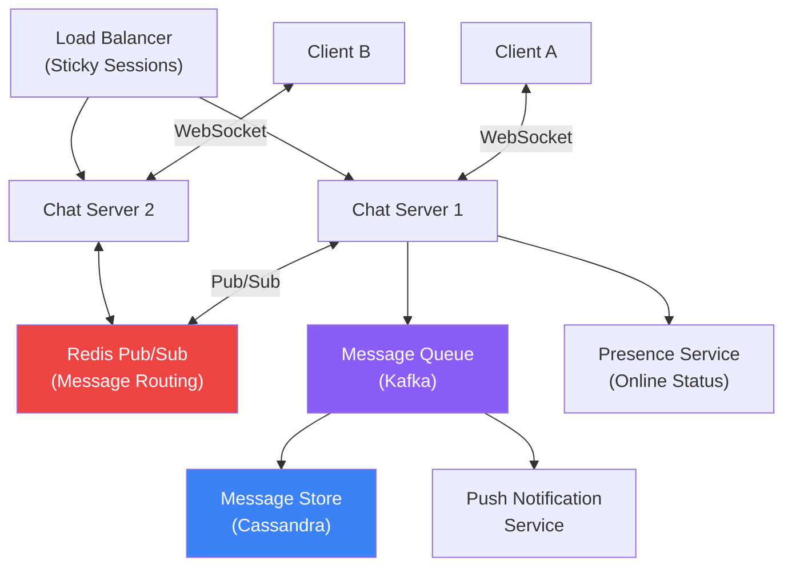

# Chat Application

Design a real-time messaging system like WhatsApp/Slack

## Design: Chat Application

### Requirements

- 1:1 messaging and group chats
- Real-time message delivery
- Offline message queuing
- Read receipts and typing indicators
- Message history and search
- Scale: 50M DAU, 500M messages/day

**Chat System Architecture**

### Key Design Decisions

- WebSocket for real-time bidirectional communication
- Sticky sessions (via user ID hash) to maintain WS connections
- Redis Pub/Sub for cross-server message routing
- Cassandra for message storage (write-heavy, partitioned by chat_id)
- Push notifications for offline users via APNs/FCM
- Message ordering: use timestamps + sequence numbers per chat
- End-to-end encryption: Signal Protocol (client-side key exchange)