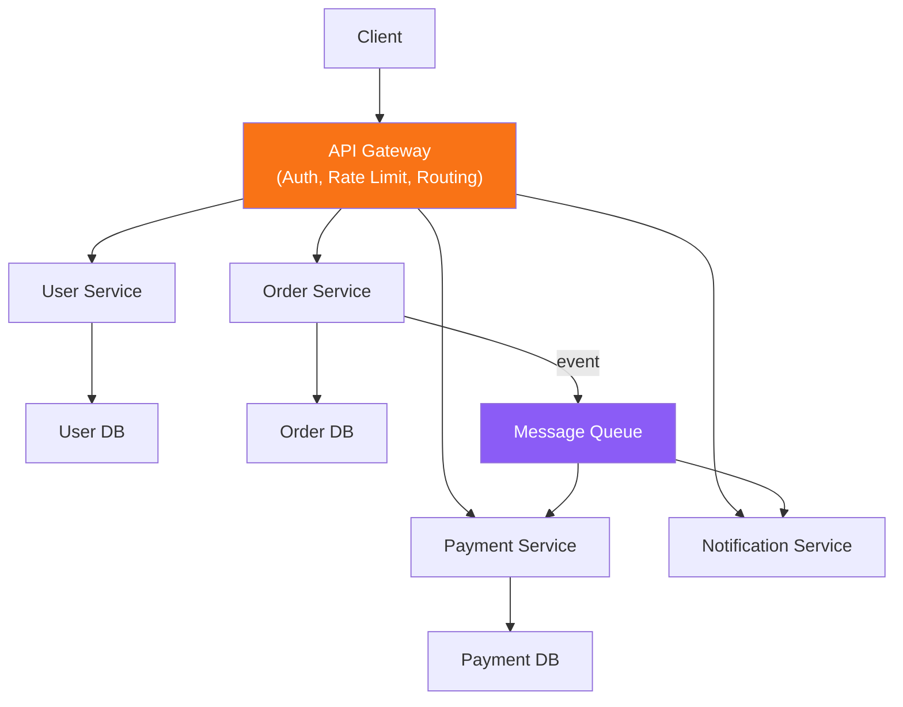

# Microservices & API Gateway

Distributed service architecture patterns

## Microservices Architecture

**Microservices with API Gateway**

### Key Patterns

- API Gateway: Single entry point — auth, rate limiting, routing, protocol translation
- Service Discovery: How services find each other (Consul, K8s DNS)
- Circuit Breaker: Prevent cascade failures — fail fast when downstream is unhealthy
- Saga Pattern: Distributed transactions across services using compensating actions
- CQRS: Separate read and write models for different optimization
- Event Sourcing: Store events instead of current state — full audit trail
- Sidecar Pattern: Attach utility containers (logging, proxy) alongside main container