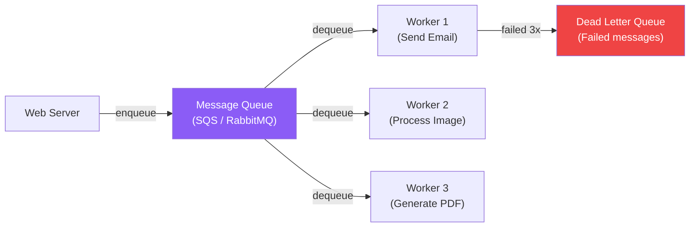

# Message Queues

Async communication, decoupling, and event-driven architectures

## Message Queues

Message queues decouple producers from consumers, enabling async processing, load leveling, and fault tolerance. Key choices: RabbitMQ (traditional broker), Kafka (distributed log), SQS (AWS managed), and Redis Streams.

**Queue-based Architecture**

- At-most-once: Message might be lost, never delivered twice (fire and forget)
- At-least-once: Message always delivered, but may be duplicated (most common)
- Exactly-once: Hard to achieve, often simulated via idempotency
- Dead Letter Queue (DLQ): Store messages that fail processing after N retries
- Back pressure: Slow down producers when consumers can't keep up