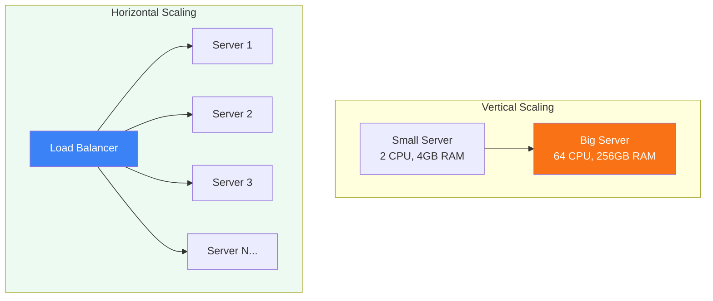

# Scalability

Horizontal vs vertical scaling, load balancing, and statelessness

## Scalability

Scalability is a system's ability to handle increased load. Vertical scaling (adding more CPU/RAM) has limits. Horizontal scaling (adding more machines) is preferred for large systems but requires statelessness and data distribution.

**Scaling Strategies**

### Load Balancing Algorithms

- Round Robin: Distribute requests sequentially
- Weighted Round Robin: Heavier servers get more traffic
- Least Connections: Route to server with fewest active connections
- IP Hash: Same client IP always hits same server (session affinity)
- Consistent Hashing: Distribute across nodes minimizing redistribution on change

### Statelessness

For horizontal scaling, servers must be stateless — no local session data. Store sessions in Redis/DynamoDB and use JWT tokens. Any server should handle any request.

<QA question="How would you handle 10x traffic increase overnight?">

1) Enable auto-scaling groups with cloud provider, 2) Add read replicas for database, 3) Implement caching layer (Redis/CDN), 4) Queue non-critical operations (email, analytics), 5) Optimize hot paths in code, 6) Set up CDN for static assets, 7) Monitor and set alerts for bottlenecks.

</QA>