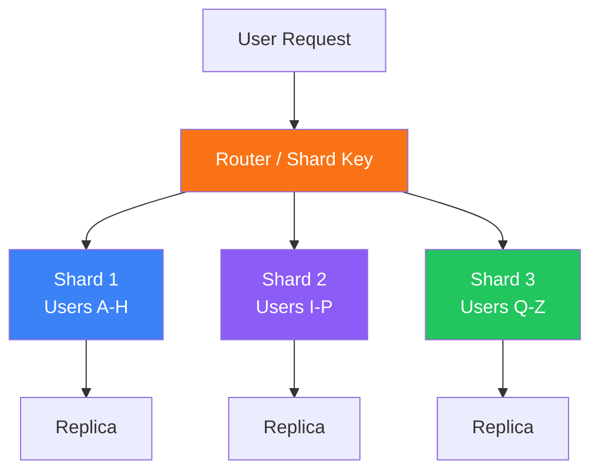

# Sharding & Partitioning

Distributing data across multiple databases

## Database Sharding

Sharding splits data across multiple database instances. Each shard holds a subset of data. This enables horizontal scaling of storage and throughput, but adds complexity around cross-shard queries, rebalancing, and transactions.

**Sharding Strategies**

### Sharding Strategies

- Range-based: Shard by ranges (A-H, I-P, Q-Z) — simple but can create hotspots
- Hash-based: Hash the shard key → distribute evenly — good distribution but range queries are hard
- Directory-based: Lookup table maps data to shards — flexible but lookup is a bottleneck
- Geographic: Shard by region — reduces latency for geo-specific data

<Callout variant="warning">

Avoid sharding as long as possible. First try: read replicas, caching, query optimization, and vertical scaling. Sharding adds significant operational complexity.

</Callout>