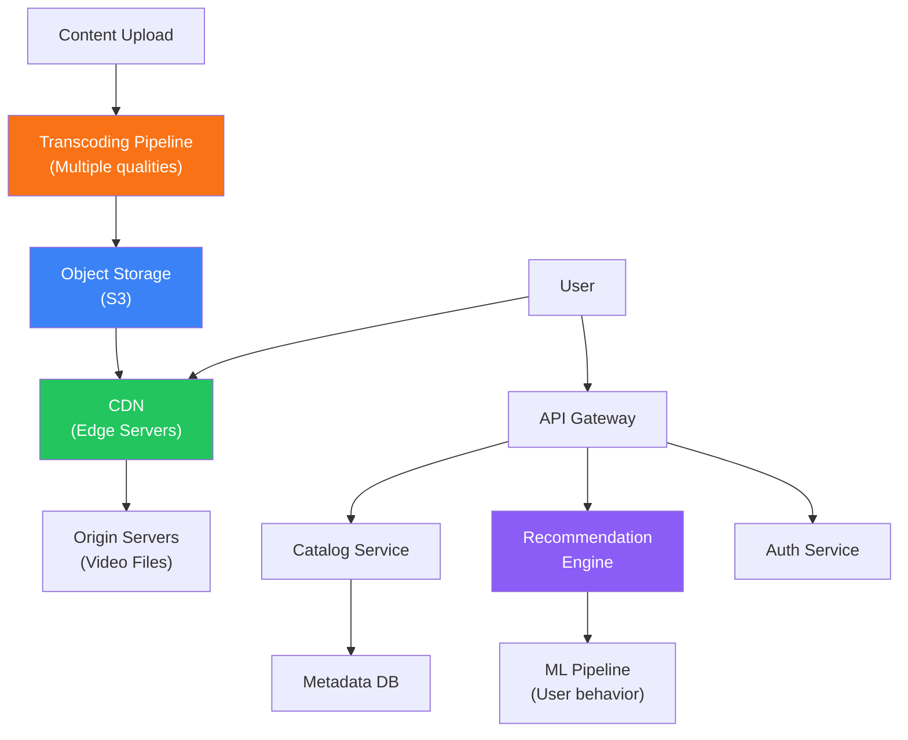

# Video Streaming (Netflix-like)

Design a large-scale video streaming platform

## Design: Video Streaming Platform

**Netflix-like Architecture**

### Key Components

- Video Transcoding: Convert uploaded video to multiple resolutions (1080p, 720p, 480p) and codecs (H.264, H.265, AV1)
- Adaptive Bitrate Streaming: HLS/DASH — client adjusts quality based on bandwidth
- CDN: Edge servers cache popular content close to users — reduces latency and origin load
- Content Delivery: Pre-position popular content at edge locations based on predictions
- Metadata Service: Movie info, categories, user profiles — PostgreSQL with Redis cache
- Recommendation Engine: Collaborative filtering + content-based ML models
- DRM: Digital Rights Management to protect content (Widevine, FairPlay)

### Scale Considerations

Netflix serves 250M+ subscribers. Key scaling strategies: 1) CDN handles 95%+ of bandwidth, 2) Microservices architecture with 1000+ services, 3) Chaos engineering (Chaos Monkey) for resilience, 4) Data-driven A/B testing for everything, 5) Open Connect — Netflix's custom CDN appliances placed in ISP networks.