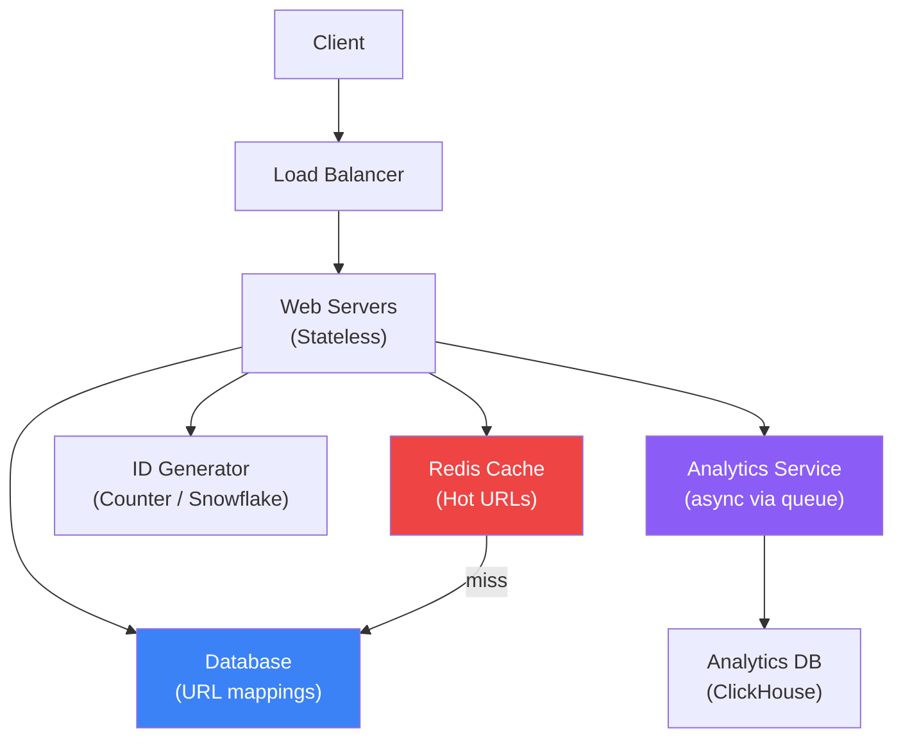

# URL Shortener

Design a system like bit.ly

## Design: URL Shortener

### Requirements

- Functional: Shorten URL, redirect to original, custom aliases, expiration
- Generate short URL for any long URL
- Redirect short URL → original URL
- Analytics: click count, referrers
- Non-functional: ~100M URLs/month, low latency reads, high availability

**URL Shortener Architecture**



### Short URL Generation

Use base62 encoding (a-z, A-Z, 0-9) of a unique counter/ID. 7 characters = 62^7 = 3.5 trillion URLs. To avoid sequential patterns, use a distributed counter (Snowflake ID) or hash-based approach.

```typescript
// Core Logic
const BASE62 = '0123456789abcdefghijklmnopqrstuvwxyzABCDEFGHIJKLMNOPQRSTUVWXYZ';

function encode(num: number): string {
  let result = '';
  while (num > 0) {
    result = BASE62[num % 62] + result;
    num = Math.floor(num / 62);
  }
  return result.padStart(7, '0');
}

// Redirect: GET /:shortCode
// 1. Check Redis cache
// 2. If miss → query DB
// 3. Return 301 (permanent) or 302 (temporary) redirect
// 4. Async: log click to analytics queue

// Database schema
// urls: { id, short_code (indexed), original_url, created_at, expires_at, user_id }
// clicks: { id, short_code, timestamp, ip, user_agent, referrer }
```

### Deep Dive Considerations

- Use 301 (cacheable) vs 302 (not cached) redirect based on analytics needs
- Rate limit URL creation to prevent abuse
- Bloom filter to check if short code exists (avoid DB lookups)
- Database: NoSQL (DynamoDB) for key-value lookups at scale
- Cache: hot URLs in Redis with TTL
- Analytics: async via Kafka → ClickHouse for fast aggregation